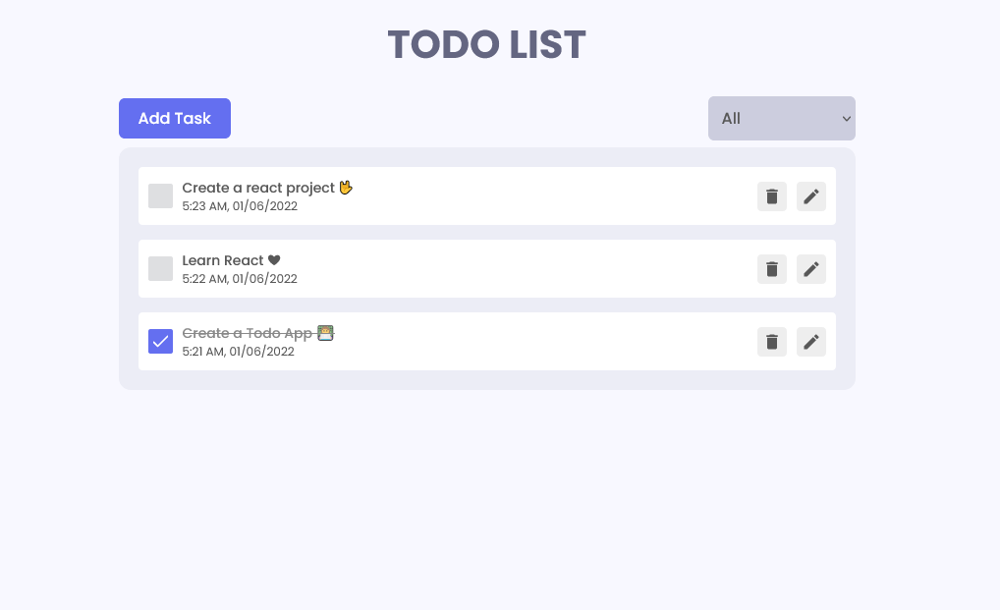

# React Todo App.

A complete todo application with all features.

Made with ❤️ by [Shaif Arfan](http://instagram.com/shaifarfan08/)

**live demo: [https://wc-react-todo-app.netlify.app/](https://wc-react-todo-app.netlify.app/)**

**Watch On Youtube: [Coming Soon](https://www.youtube.com/webcifarOfficial)**

---

## Project Description

In the project, we will be creating a Complete Todo Application with all features. We will do all the CRUD operations. We will to use `React.js` and to manage our states, we will use `Redux`. Also we will learn to make simple animations using `Framer Motion`. This will be a complete `beginner` friendly app. Hope you enjoy it.

## What we are going to learn/use

- [React](https://reactjs.org/)
- [React Redux](https://redux.js.org/)
- [Framer Motion](https://framer.com/motion/)
- [React icons](https://react-icons.netlify.com/)
- [CogoToast](https://cogito.systems/cogito-toast/)
- More...

## Requirements

- Basic ReactJs knowledge
- Basic HTML, CSS knowledge

## Starter files

You can find all the starter files in `starter-files` branch. You can to go to the `starter-files` branch and `download zip` the the starter files or You can clone the project and git checkout to `starter-files` branch.

## Getting Started

The recommended way to get started with the project is Follow the `YouTube tutorial`. You will find all the step-by-step guides. Or you Can start the project on your own by following the guide below.

After getting the starter files, you need to go the file directory and run

```shell
npm install
```

and after that start the dev server.

```shell
npm start
```

## Tools Used

1. Favicon: [Flaticon.com](https://www.flaticon.com/)
1. Code Editor: [VS Code](https://code.visualstudio.com/)

## Similar Projects

Here are some Similar projects that you might be interested.

- [Artistic - React JS Project](https://github.com/ShaifArfan/artistic)
- [Ayan's Portfolio - React JS Project](https://github.com/ShaifArfan/AYANs-portfolio)
- [Shaif's Cuisine - HTML, CSS project](https://github.com/ShaifArfan/shaif-s-cuisine)
- [Amy's Portfolio - HTML, CSS Project](https://github.com/ShaifArfan/AMYs-Portfolio)

---

## FAQ

### Q: How can i get started?

You can get started by following the `YouTube tutorial` of this project. Here is the full tutorial video link: [coming soon].

### Q: What i need to start the project?

Just open your favorite code editor and follow along with the `YouTube Tutorial`.

### Q: Who the project is for?

The project is for the people who wanna get more skilled in `ReactJs`.

---

## Feedback

If you have any feedback, please reach out to us at [@web_cifar](http://instagram.com/web_cifar)

## Support

For support, join our [Community Group](http://facebook.com/groups/webcifar).

## License

[MIT](https://choosealicense.com/licenses/mit/)

Happy Coding! 🚀
